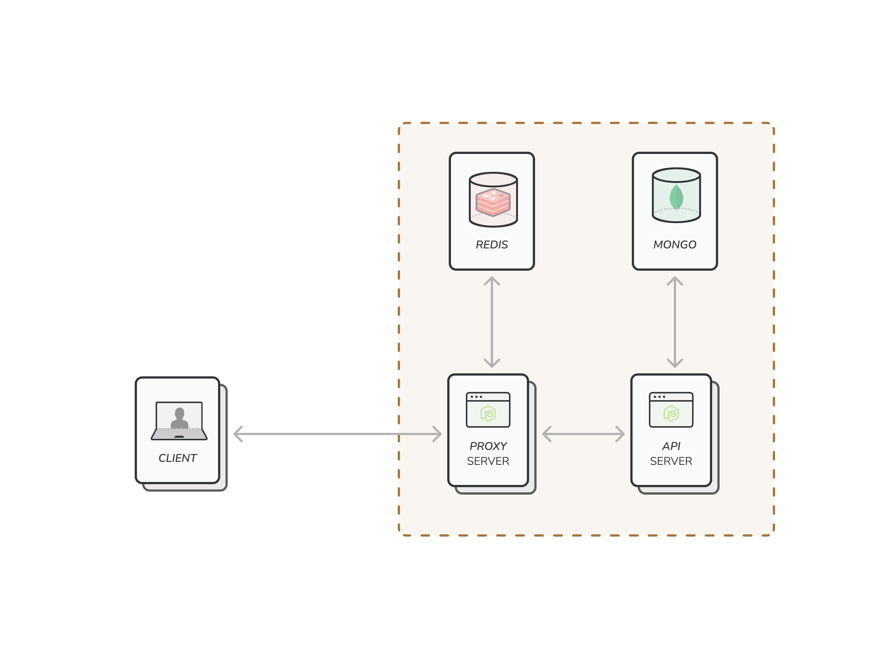

# Request Cacher

This project is a request caching system built using two Express js servers. One server acts as a proxy, caching requests to Redis, while the other contains an API connected to MongoDB.

This project is designed to optimize response times and reduce load on the MongoDB by caching frequently requested data using Redis. The architecture consists of two Express servers:

- **Proxy Server**: Listens for incoming requests, checks if the requested data is available in Redis cache, and serves it if found. If not found, it retrieves the data from the API Server, caches it in Redis, and returns the response to the client.

- **API Server**: Contains endpoints to handle various requests and interacts with a MongoDB database to fetch data.

